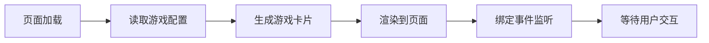

# GitHub Pages 游戏原型展示平台设计方案

## 项目概述

为 pinable.cc 创建一个现代化、响应式的游戏原型展示平台，动态加载 `.chatgame/design_iterations` 目录中的游戏原型，提供优雅的浏览和体验。

## 设计理念

### 核心特点
- **现代化设计**：采用渐变背景、玻璃态效果、流畅动画
- **游戏化风格**：活泼的色彩、圆润的边角、趣味性交互
- **响应式布局**：完美适配桌面、平板、手机
- **动态加载**：自动扫描并展示所有游戏原型
- **即时预览**：点击即玩，无需跳转

## 技术架构

### 技术栈
```
前端框架：原生 HTML5 + CSS3 + JavaScript (ES6+)
图标库：Lucide Icons
字体：Google Fonts (Poppins, Outfit, JetBrains Mono)
广告：Google AdSense
部署：GitHub Pages
```

### 文件结构
```
pinable.cc/
├── index.html                 # 主页入口
├── assets/
│   ├── css/
│   │   ├── main.css          # 主样式文件
│   │   └── themes.css        # 主题变量
│   ├── js/
│   │   ├── app.js            # 主应用逻辑
│   │   └── game-loader.js    # 游戏加载器
│   └── images/
│       └── placeholder.svg    # 占位图
├── .chatgame/
│   └── design_iterations/     # 游戏原型目录
├── CNAME                      # 域名配置
├── ads.txt                    # 广告配置
└── README.md                  # 项目说明
```

## 视觉设计

### 配色方案

```css
/* 主色调 - 活力渐变 */
--primary-gradient: linear-gradient(135deg, #667eea 0%, #764ba2 100%);
--secondary-gradient: linear-gradient(135deg, #f093fb 0%, #f5576c 100%);
--success-gradient: linear-gradient(135deg, #4facfe 0%, #00f2fe 100%);

/* 背景色 */
--bg-primary: #0f0f23;        /* 深色背景 */
--bg-secondary: #1a1a2e;      /* 次级背景 */
--bg-card: rgba(255, 255, 255, 0.05);  /* 卡片背景 */

/* 文字色 */
--text-primary: #ffffff;
--text-secondary: rgba(255, 255, 255, 0.7);
--text-muted: rgba(255, 255, 255, 0.5);

/* 强调色 */
--accent-purple: #667eea;
--accent-pink: #f5576c;
--accent-cyan: #00f2fe;
--accent-green: #4ade80;
--accent-yellow: #fbbf24;
```

### 设计元素

#### 1. 页面头部（Hero Section）
```
┌─────────────────────────────────────────┐
│  🎮 Pinable Game Prototypes             │
│                                         │
│  探索创意游戏原型                        │
│  [搜索框]                                │
└─────────────────────────────────────────┘
```

**特点：**
- 大标题使用渐变色
- 动态粒子背景效果
- 居中搜索框，支持实时筛选
- 简洁的副标题说明

#### 2. 游戏卡片网格
```
┌──────────┐  ┌──────────┐  ┌──────────┐
│ [预览图] │  │ [预览图] │  │ [预览图] │
│          │  │          │  │          │
│ 游戏标题 │  │ 游戏标题 │  │ 游戏标题 │
│ 简短描述 │  │ 简短描述 │  │ 简短描述 │
│ [标签]   │  │ [标签]   │  │ [标签]   │
│ [开始玩] │  │ [开始玩] │  │ [开始玩] │
└──────────┘  └──────────┘  └──────────┘
```

**卡片设计：**
- 玻璃态效果（backdrop-filter: blur）
- 悬停时上浮动画
- 渐变边框
- 圆角设计（24px）
- 阴影效果

#### 3. 游戏模态窗口
```
┌─────────────────────────────────────────┐
│  ← 返回                            ✕    │
│                                         │
│  ┌───────────────────────────────────┐ │
│  │                                   │ │
│  │      游戏 iframe 容器              │ │
│  │                                   │ │
│  └───────────────────────────────────┘ │
│                                         │
│  游戏标题                                │
│  游戏描述和说明                          │
└─────────────────────────────────────────┘
```

**特点：**
- 全屏模态窗口
- iframe 嵌入游戏
- 平滑过渡动画
- 支持 ESC 键关闭

## 功能设计

### 1. 动态游戏加载系统

```javascript
// 游戏配置数据结构
const gameConfig = {
  'bubble_shooter_1.html': {
    title: '🎯 泡泡龙',
    description: '经典泡泡射击游戏，消除相同颜色的泡泡',
    tags: ['休闲', '益智', '射击'],
    theme: 'bubble_theme.css',
    thumbnail: 'auto', // 自动生成或使用截图
    featured: true
  },
  'frog_travel_game_1.html': {
    title: '🐸 小青蛙旅行',
    description: '帮助小青蛙跳跃收集花朵，探索美丽世界',
    tags: ['冒险', '平台', '休闲'],
    theme: 'frog_game_theme.css',
    thumbnail: 'auto',
    featured: true
  }
};
```

**加载流程：**


### 2. 搜索和筛选功能

**搜索特性：**
- 实时搜索（输入即搜）
- 支持标题、描述、标签搜索
- 高亮匹配结果
- 无结果提示

**筛选选项：**
- 按标签筛选
- 按特色游戏筛选
- 按最新添加排序

### 3. 响应式布局

**断点设计：**
```css
/* 移动设备 */
@media (max-width: 640px) {
  /* 1列布局 */
  .game-grid { grid-template-columns: 1fr; }
}

/* 平板设备 */
@media (min-width: 641px) and (max-width: 1024px) {
  /* 2列布局 */
  .game-grid { grid-template-columns: repeat(2, 1fr); }
}

/* 桌面设备 */
@media (min-width: 1025px) {
  /* 3列布局 */
  .game-grid { grid-template-columns: repeat(3, 1fr); }
}

/* 大屏设备 */
@media (min-width: 1440px) {
  /* 4列布局 */
  .game-grid { grid-template-columns: repeat(4, 1fr); }
}
```

## 交互设计

### 动画效果

#### 1. 页面加载动画
```css
@keyframes fadeInUp {
  from {
    opacity: 0;
    transform: translateY(30px);
  }
  to {
    opacity: 1;
    transform: translateY(0);
  }
}
```

#### 2. 卡片悬停效果
```css
.game-card:hover {
  transform: translateY(-8px) scale(1.02);
  box-shadow: 0 20px 40px rgba(102, 126, 234, 0.3);
}
```

#### 3. 模态窗口动画
```css
@keyframes modalSlideIn {
  from {
    opacity: 0;
    transform: scale(0.9);
  }
  to {
    opacity: 1;
    transform: scale(1);
  }
}
```

### 用户交互流程

```
用户访问主页
    ↓
浏览游戏卡片
    ↓
点击"开始玩"按钮
    ↓
模态窗口打开，加载游戏
    ↓
在 iframe 中体验游戏
    ↓
点击返回或 ESC 键关闭
    ↓
返回主页继续浏览
```

## 性能优化

### 1. 图片优化
- 使用 WebP 格式
- 懒加载游戏缩略图
- 响应式图片（srcset）

### 2. 代码优化
- CSS/JS 压缩
- 关键 CSS 内联
- 异步加载非关键资源

### 3. 缓存策略
```html
<!-- Service Worker 缓存 -->
<script>
if ('serviceWorker' in navigator) {
  navigator.serviceWorker.register('/sw.js');
}
</script>
```

## Google AdSense 集成

### 广告位置

1. **顶部横幅广告**
   - 位置：页面顶部
   - 尺寸：自适应横幅
   - 样式：与页面风格融合

2. **侧边栏广告**（桌面端）
   - 位置：右侧固定
   - 尺寸：300x600
   - 样式：玻璃态卡片

3. **游戏间广告**
   - 位置：每3个游戏卡片后
   - 尺寸：自适应
   - 样式：原生广告风格

### 广告代码示例
```html
<!-- 顶部横幅 -->
<div class="ad-banner">
  <script async src="https://pagead2.googlesyndication.com/pagead/js/adsbygoogle.js?client=ca-pub-7256060087403757"
       crossorigin="anonymous"></script>
  <ins class="adsbygoogle"
       style="display:block"
       data-ad-client="ca-pub-7256060087403757"
       data-ad-slot="YOUR_SLOT_ID"
       data-ad-format="auto"
       data-full-width-responsive="true"></ins>
  <script>
       (adsbygoogle = window.adsbygoogle || []).push({});
  </script>
</div>
```

## SEO 优化

### Meta 标签
```html
<meta name="description" content="探索创意游戏原型集合，包括泡泡龙、小青蛙旅行等趣味小游戏">
<meta name="keywords" content="游戏原型,HTML5游戏,在线游戏,泡泡龙,小游戏">
<meta property="og:title" content="Pinable Game Prototypes - 创意游戏原型展示">
<meta property="og:description" content="探索创意游戏原型集合">
<meta property="og:image" content="https://pinable.cc/assets/images/og-image.png">
<meta name="twitter:card" content="summary_large_image">
```

### 结构化数据
```json
{
  "@context": "https://schema.org",
  "@type": "WebSite",
  "name": "Pinable Game Prototypes",
  "url": "https://pinable.cc",
  "description": "创意游戏原型展示平台"
}
```

## 部署流程

### GitHub Pages 配置

1. **仓库设置**
   - 启用 GitHub Pages
   - 选择主分支
   - 自定义域名：pinable.cc

2. **CNAME 配置**
   ```
   pinable.cc
   ```

3. **DNS 配置**
   ```
   A记录: 185.199.108.153
   A记录: 185.199.109.153
   A记录: 185.199.110.153
   A记录: 185.199.111.153
   ```

### 自动化部署

```yaml
# .github/workflows/deploy.yml
name: Deploy to GitHub Pages

on:
  push:
    branches: [ main ]

jobs:
  deploy:
    runs-on: ubuntu-latest
    steps:
      - uses: actions/checkout@v2
      - name: Deploy
        uses: peaceiris/actions-gh-pages@v3
        with:
          github_token: ${{ secrets.GITHUB_TOKEN }}
          publish_dir: ./
```

## 可访问性（A11y）

### ARIA 标签
```html
<button aria-label="开始玩泡泡龙游戏">开始玩</button>
<nav aria-label="游戏分类导航">...</nav>
<main aria-label="游戏列表">...</main>
```

### 键盘导航
- Tab 键切换焦点
- Enter 键激活按钮
- ESC 键关闭模态窗口
- 方向键浏览游戏卡片

### 对比度
- 文字与背景对比度 ≥ 4.5:1
- 大文字对比度 ≥ 3:1
- 交互元素清晰可见

## 浏览器兼容性

### 目标浏览器
- Chrome 90+
- Firefox 88+
- Safari 14+
- Edge 90+
- 移动浏览器（iOS Safari, Chrome Mobile）

### Polyfills
```html
<!-- 支持旧浏览器 -->
<script src="https://polyfill.io/v3/polyfill.min.js?features=es6"></script>
```

## 未来扩展

### 第一阶段（当前）
- ✅ 基础展示平台
- ✅ 动态加载游戏
- ✅ 响应式设计
- ✅ 搜索筛选

### 第二阶段
- 🔄 用户评分系统
- 🔄 游戏收藏功能
- 🔄 社交分享
- 🔄 评论系统

### 第三阶段
- 📋 游戏排行榜
- 📋 用户账户系统
- 📋 游戏统计分析
- 📋 多语言支持

## 总结

这个设计方案将创建一个：
- **视觉吸引力强**的现代化游戏展示平台
- **用户体验优秀**的响应式网站
- **易于维护**的动态加载系统
- **SEO 友好**的静态网站
- **性能优化**的轻量级应用

通过这个平台，用户可以轻松浏览和体验所有游戏原型，为项目提供专业的展示窗口。